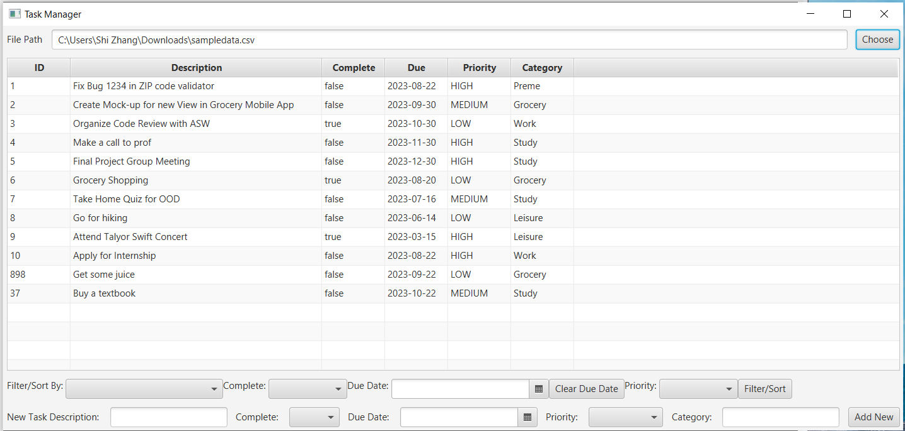
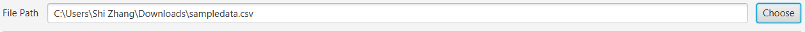
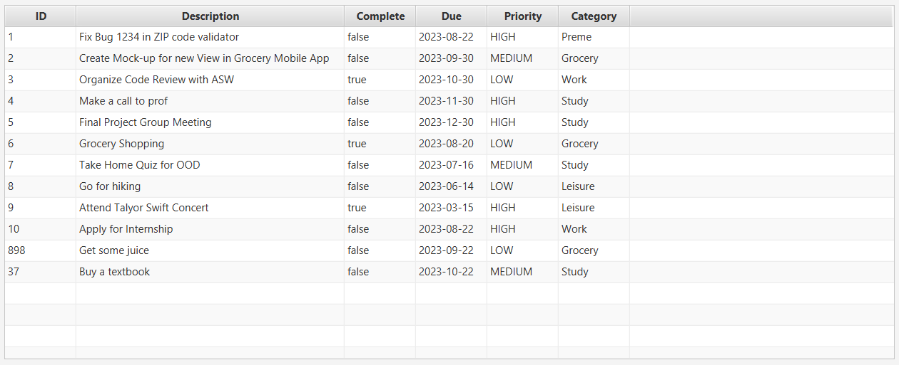
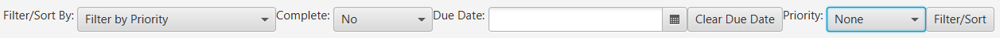
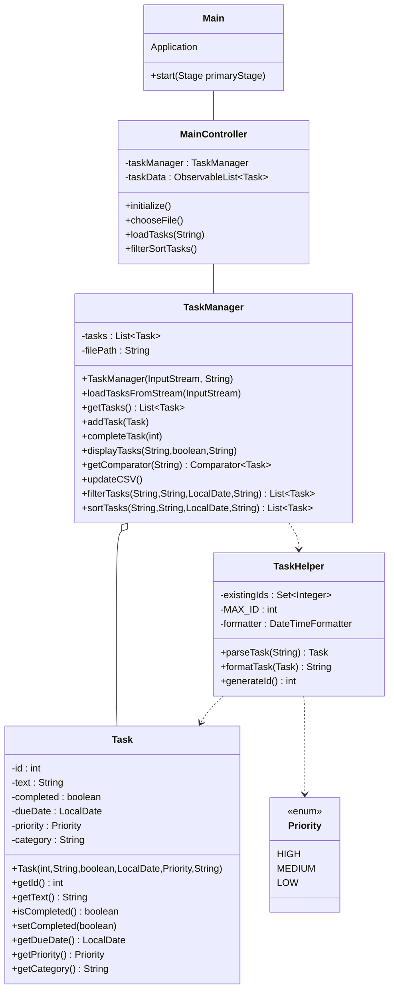

# Task Manager, JavaFX Desktop Application

Programming Languages and Tech Stacks: Java, JavaFX, Maven

Author: Shi Zhang

# Project Description

Recognized the need for an organized and efficient desktop application that allows users to manage, filter, and sort tasks effectively.

Shi Zhang independently designed and developed a JavaFX application that provides users with intuitive functionalities for task management and categorization.

- Designed a user interface using JavaFX, offering components like task input, filter/sort controls, and a dynamic task table display.
- Implemented core task management functionalities in the TaskManager class, including task loading and saving.
- Utilized Java's Stream API in combination with the TaskManager class to implement comprehensive filter/sort capabilities, allowing users to view tasks based on attributes like completion status, due date, and priority.
- Incorporated file handling functionalities, enabling users to seamlessly import and export task data using CSV files.
- Adhered to object-oriented design principles, ensuring the application's modularity, maintainability, and scalability.

## Task Manager Application - User Guide

### Graphic User Interface

- **File Path Panel:**

The first `HBox` (horizontal box) contains components for selecting the task file. It contains:

- A `Label` displaying the text "File Path".
- A `TextField` (identified by `fx:id="filePathField"`), where the user can manually type in a file path or view the path of the selected file.
- A `Button` with the text "Choose" (`fx:id="chooseButton"`), which triggers the file selection action when clicked.

- **Task Table:**

The `TableView` (identified by `fx:id="taskTable"`) displays the tasks. It contains five columns for "ID", "Description", "Complete", "Due", "Priority", and "Category".

Task ID: This field is auto-generated and cannot be edited.
Description: Enter a description for the task.
Complete: Select 'Yes' or 'No' to set the completion status of the task.
Due Date: Select the due date for the task using the date picker.
Priority: Select the priority for the task from the dropdown menu.
Category: A label to define the type of the task.

- **Filter/Sort Panel:**

The second `HBox` contains components for filtering and sorting tasks. It contains:

- A `Label` displaying the text "Filter/Sort By: ".
- A `ComboBox` (`fx:id="filterSortComboBox"`) for selecting the attribute to filter or sort by.
- Labels and corresponding `ComboBox` or `DatePicker` for selecting values of "Complete", "Due Date", and "Priority".
- A `Button` (identified by `fx:id="filterSortButton"`) labeled "Filter/Sort", which triggers the filter/sort action when clicked.

- **New Task Panel:**

The third `HBox` contains components for adding new tasks. It contains:

- A `TextField` (`fx:id="newTaskField"`), for inputting the new task's description.
- A `ComboBox` (`fx:id="completeComboBox"`), for selecting whether the new task is completed or not.
- A `DatePicker` (`fx:id="dueDatePicker"`), for selecting the due date of the new task.
- A `ComboBox` (`fx:id="priorityComboBox"`), for selecting the priority of the new task.
- A `TextField` (`fx:id="categoryField"`), for inputting the category of the new task.
- A `Button` (identified by `fx:id="addButton"`) labeled "Add New", which triggers the task addition action when clicked.

The layout is organized in a vertical box (`VBox`), with the main components (File Path Panel, Task Table, Filter/Sort Panel, and New Task Panel) stacked from top to bottom.

### Functionality

- Startup: Run the application. The main window of the Task Manager will appear.

- Task Overview Panel: The main screen provides an overview of all tasks. Each row represents a single task with details such as Task ID, Task Description, Priority, Due Date, and Completion Status.

- Adding a New Task: To create a new task, Fill in the details in the form that appears, click on the 'Add New' button.

- Filtering Tasks: You can filter tasks based on different criteria like priority, due date, and completion status. Select the criterion from the 'Filter By' dropdown menu, set the desired value, and click on the 'Filter' button.

- Sorting Tasks: You can sort tasks based on different criteria like priority, due date, and completion status. Select the criterion from the 'Sort By' dropdown menu and click on the 'Sort' button.

- Resetting Filters and Sorts: To reset all applied filters and sorts, select "None" for the dropdown options and click the "clear the due date" button, then click "Filter/Sort" button again, it should bring back the original full list of tasks.

# Updated UML

# Task Manger Application Demo

